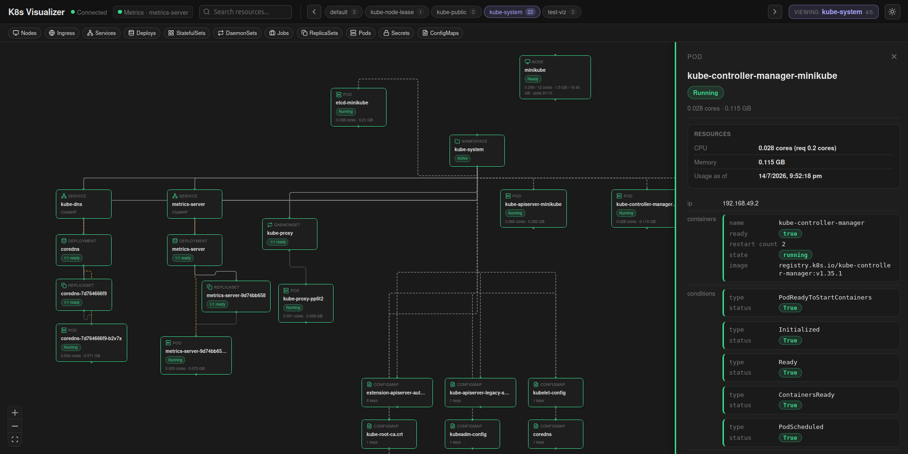
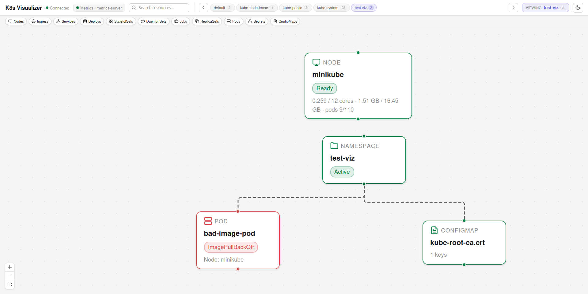
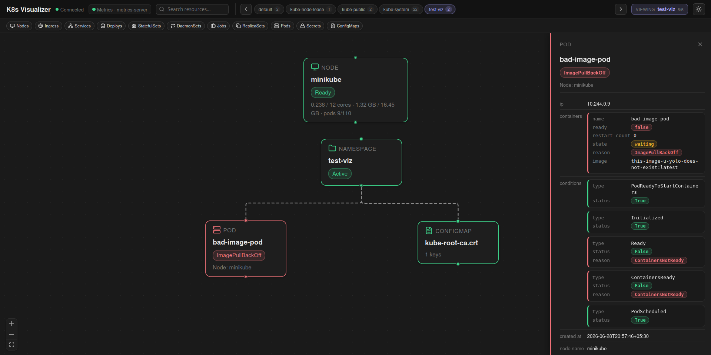

# Kubernetes Cluster Visualizer

Real-time topology graph for a Kubernetes cluster: resources, ownership/routing edges, health, and optional CPU/memory usage.







## Features

- Topology graph: Pods, Deployments, ReplicaSets, Services, Ingresses, StatefulSets, DaemonSets, Jobs, Secrets, ConfigMaps, Nodes
- Edges: ownership (Deploy/RS/STS/DS/Job -> Pod), Service selectors, Ingress -> Service
- One namespace at a time (full canvas) with switcher; related resources grouped as DAG columns
- Live updates via informers + WebSocket (not polling)
- Resource type filters, search, detail panel (status, containers, conditions, usage)
- Optional metrics via Metrics Server (`kubectl top` API): pod/node CPU (cores) and memory (GB)

## Prerequisites

- Go 1.26+
- Node.js >= 20.10, npm >= 10.8 (dev UI only)
- Cluster access (`KUBECONFIG` or in-cluster SA)
- Optional: Metrics Server for usage (`minikube addons enable metrics-server`)

## Quick start (out of cluster)

```bash
export KUBECONFIG=~/.kube/config   # if needed
go mod tidy
go run main.go
```

- UI (embedded): http://localhost:8081
- WebSocket: :8080

Dev frontend (hot reload):

```bash
cd ui && npm install && npm run dev
# http://localhost:5173  (WS still :8080)
```

After UI changes that ship with the binary:

```bash
cd ui && npm run build
# commit ui/dist (//go:embed)
```

## Metrics

Default: `METRICS_PROVIDER=metrics-server`. Topology works without it.

| Env | Default | Notes |
|-----|---------|--------|
| `METRICS_PROVIDER` | `metrics-server` | or `none` |
| `METRICS_INTERVAL` | `15s` | scrape period |
| `METRICS_TIMEOUT` | `10s` | per scrape |

See [docs/metrics.md](./docs/metrics.md).

## In-cluster

```bash
kubectl create -f https://raw.githubusercontent.com/Saumya40-codes/k8s-visualizer/refs/heads/master/yamls/all-in-one.yaml
kubectl get pods
kubectl port-forward svc/k8s-visualizer-backend-<tag> 8081:8081
kubectl port-forward svc/k8s-visualizer-backend-<tag> 8080:8080
```

Open http://localhost:8081

## Architecture

```
React UI (:8081 / Vite :5173)
    |  WebSocket
Go backend (:8080)
    |  SharedInformers (List+Watch) + optional metrics.k8s.io
Kubernetes API
```

State is rebuilt on informer events (debounced) and pushed to all WS clients. Metrics enrich pod/node usage when available.

## License

See repository license file if present.
